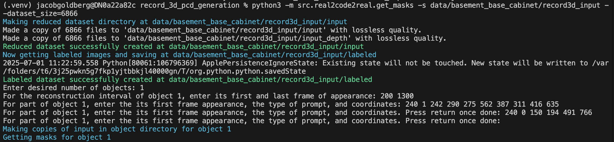

# record_3d_pcd_generation
Recreate Erics PCD generation and add pcd to simple urdf primitives heuristic

TODO: add comments on erics portion of the code, update readme with full directions of the pipeline, create pcd to urdf simple geometries heuristic, get mesh generation portion working

## Setup Directions
### 1. Clone repo
```bash
git clone https://github.com/jcub-gold/record_3d_pcd_generation
```
### 2. Install requirements
```bash
mamba create -y -n r2c2r python=3.10 pip cmake ninja
mamba activate r2c2r


pip install -r requirements.txt
```
### 3. Download sam2 checkpoints
```bash
cd submodules/sam2/checkpoints
bash download_ckpts.sh
```

## Pipeline Directions:

### 1. Setup the data structure for the scene
```bash
python3 -m src.real2code2real.setup_structure --scene_name=example_scene --num_objects=1 --num_states=1
```
- scene_name specifies the name of your scene
- num_objects specifies the number of objects in your scene
- num_states specifies the number of states per object

### 2.  Scan input data
- Scan video with Record3d
- Export as EXR + JPG
- Go to Files app and transfer to computer, the output folder should contain format:
```
data/scene_name/record3d_input/
├── depth/
│   ├── 0.exr
│   ├── 1.exr
│   └── ...
├── rgb/
│   ├── 0.jpg
│   ├── 1.jpg
│   └── ...
└── metadata.json
```

### 3. Segment frames
```bash
python3 -m src.real2code2real.get_masks --scene_name=example_scene --dataset_size=1200
```
- dataset_size specifies how many input frames to down-sample and use
- Run real2code2real/get_masks.py with the new dataset size and how many objects to segment. Then for each object, enter in:
    - start_frame end_frame
    - frame1 frame_state pixel1X pixel1Y pixel2X pixel2Y …
    - frame2 frame_state pixel1X pixel1Y …
    - Double enter once done filling in the current object
    - frame_state = 1 means points are positive and will be included. frame_state = -1 means do not include any instance of the specified object in the segmented mas.draw boxes with pairs of points using frame_state = 0 (frame_state = 0 NOT recommended)
    - Can check the pixels using labeled directory or using Jacob’s pixel selector

Example Run:


- At the end of generation, the input directory will look like:
```
scene_name/
├── depth/
├── input/
│   ├── 0.jpg
│   ├── 1.jpg
│   └── ...
├── input_depth/
│   ├── [m].exr
│   ├── [m+1].exr
│   └── ...
├── labeled/
│   ├── 0.jpg
│   ├── 1.jpg
│   └── ...
├── object_1/
│   ├── images/
│   │   ├── [m].png
│   │   ├── [m+1].png
│   │   └── ...
│   ├── input/
│   │   ├── [m].jpg
│   │   ├── [m+1].jpg
│   │   └── ...
│   ├── output/
│   │   └── masked_video.mp4
├── rgb/
├── metadata.json
└── new_metadata.json
```

### 4. PCD Generation
```bash
python3 -m src.real2code2real.generate_pcds --scene_name=example_scene --eps=0.03 --min_points=15 --nb_neighbors=15 --std_ratio=2 --load_cached_frames=True
```
- choose frames for pcd generation or run script to select frames per object to be used for pcd generation (usally the first frame is bad and around 2 frames is recommended)

### 5. Simple URDF Generation
```bash
python3 -m src.real2code2real.generate_simple_urdf --scene_name=example_scene --load_cached_labels=True
```
- label each object

### 6. Mesh Generation


test